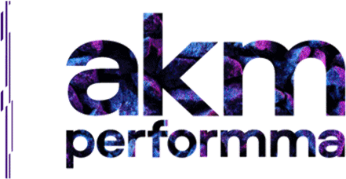

# [)](https://git.io/typing-svg)

> O objetivo deste projeto é criar um aplicativo CRUD para gerenciamento de tarefas, permitindo aos usuários: **criar, visualizar, editar e excluir** tarefas de forma eficiente.

## Requisitos Funcionais Implementados

<table>
    <thead>
        <tr>
            <th>📄 Título</th>
            <th>📋 Descrição</th>
        </tr>
    </thead>
    <tbody>
        <tr>
            <td><b>🏠 Página Inicial</b></td>
            <td>
                <ul>
                    <li>🔍 Foi criada uma página inicial limpa e intuitiva usando <a href="https://getbootstrap.com/">Bootstrap</a> para listar as tarefas atuais.</li>
                    <li>📅 A lista de tarefas é exibida, incluindo título, descrição, status, responsável, prazo e data de criação.</li>
                </ul>
            </td>
        </tr>
        <tr>
            <td><b>Criar ➕</b></td>
            <td>
                <ul>
                    <li>📝 Um formulário foi implementado para adicionar novas tarefas.</li>
                    <li>✅ Os campos obrigatórios, como título e descrição da tarefa, foram configurados com validação de formulário para garantir o preenchimento adequado.</li>
                </ul>
            </td>
        </tr>
        <tr>
            <td><b>Editar ✏️ </b></td>
            <td>
                <ul>
                    <li>🔄 Foi adicionada a funcionalidade de edição de tarefas existentes.</li>
                    <li>📝 Os usuários podem modificar o título, descrição, responsável e a data de conclusão da tarefa.</li>
                </ul>
            </td>
        </tr>
        <tr>
            <td><b>Excluir 🗑️</b></td>
            <td>
                <ul>
                    <li>❌ Os usuários podem excluir tarefas individualmente.</li>
                    <li>🤔 Uma confirmação é solicitada antes da exclusão.</li>
                </ul>
            </td>
        </tr>
    </tbody>
</table>


## Requisitos Técnicos

- O back-end do aplicativo foi criado em **PHP** para lidar com a lógica de negócios e a interação com o banco de dados.
- **JavaScript** foi usado para adicionar interatividade à interface do usuário, incluindo validação de formulário, confirmação de exclusão e carregamento dinâmico de dados.
- **Bootstrap** foi utilizado para criar um design atraente e responsivo para o aplicativo.
- Os dados das tarefas são armazenados em um banco de dados **MySQL**, com tabelas apropriadas criadas para a finalidade.

## Banco de dados
Crie um banco de dados e execute as instruções SQLs abaixo para criar as tabelas `projects`, `users` e `tasks`:

```sql
-- Criação da tabela "projects"
CREATE TABLE projects (
    id INT(10) UNSIGNED NOT NULL AUTO_INCREMENT,
    titulo VARCHAR(255) NOT NULL COLLATE utf8mb4_general_ci,
    description TEXT NOT NULL COLLATE utf8mb4_general_ci,
    ativo ENUM('s','n') NOT NULL COLLATE utf8mb4_general_ci,
    date TIMESTAMP NOT NULL DEFAULT current_timestamp() ON UPDATE current_timestamp(),
    PRIMARY KEY (id)
);

-- Criação da tabela "users"
CREATE TABLE users (
    id INT(10) UNSIGNED NOT NULL AUTO_INCREMENT,
    name VARCHAR(100) NOT NULL COLLATE utf8mb4_general_ci,
    email VARCHAR(150) NOT NULL COLLATE utf8mb4_general_ci,
    password VARCHAR(20) NOT NULL COLLATE utf8mb4_general_ci,
    username VARCHAR(10) COLLATE utf8mb4_general_ci,
    PRIMARY KEY (id)
);

-- Criação da tabela "tasks"
CREATE TABLE tasks (
    id INT(11) UNSIGNED NOT NULL AUTO_INCREMENT,
    idProject INT(11) NOT NULL,
    name VARCHAR(50) NOT NULL COLLATE utf8mb4_general_ci,
    description VARCHAR(300) NOT NULL COLLATE utf8mb4_general_ci,
    completed TINYINT(1) NOT NULL,
    notes VARCHAR(150) COLLATE utf8mb4_general_ci DEFAULT NULL,
    deadline DATE NOT NULL,
    createdAt DATETIME NOT NULL,
    updatedAt DATETIME NOT NULL,
    PRIMARY KEY (id),
    KEY idx_idProject (idProject)
);
```

## Configuração
As credenciais do banco de dados estão no arquivo `config.php` e você deve alterar para as configurações do seu ambiente (HOST, NAME, USER e PASS).

> ℹ️ *Nota:* Certifique-se de que seu ambiente de desenvolvimento está configurado adequadamente e que as dependências, como PHP e MySQL, estão instaladas.

## Tecnologias

Frontend:


Backend:


Database:


Versionamento:


IDEs:


## Contribuições

Contribuições são bem-vindas! Se você quiser contribuir para o desenvolvimento deste projeto, siga as práticas recomendadas para contribuição, incluindo a criação de um fork e a abertura de uma solicitação pull.

<div align="center">Criado por <a href="https://github.com/Amanda-ribeiiro">Amanda Ribeiro.</a>

</div>


